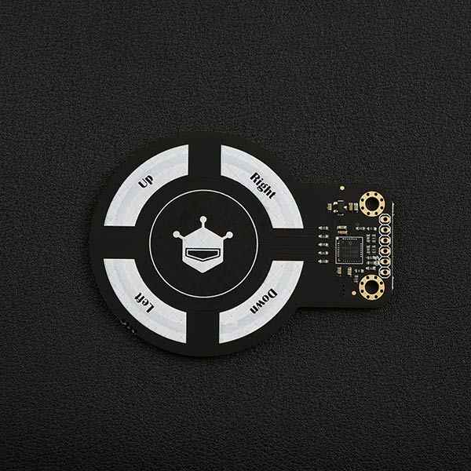

# DFRobot_MGC3130

- [中文版](./README_CN.md)

3D手势识别传感器是一款集成3D手势识别和运动跟踪为一体的交互式传感器，传感器可以在有效范围内识别手指的顺时针/逆时针转动方向和手指的运动方向等。传感器基于Microchip专利的GestIC®技术，采用电近场传感技术，包括了开发3D手势输入传感系统所有的块图，具有先进的3D信号处理单元，有效检测距离为0~10 cm。





## Product Link(https://www.dfrobot.com/product-1538.html)

    SKU：SEN0202

## Table of Contents

* [Summary](#summary)
* [Installation](#installation)
* [Methods](#methods)
* [Compatibility](#compatibility)
* [History](#history)
* [Credits](#credits)

## Summary

库中提供了手势识别、接触识别、接近位置监测三个示例。

手势识别：左-->右、右-->左、上-->下、下-->上

接触识别：上下左右中的单击、上下左右中的双击、上下左右中的触摸

接近位置识别：X、Y、Z三轴方向上的位置数据

## Installation

使用此库前，请首先下载库文件，将其粘贴到\Arduino\libraries目录中，然后打开examples文件夹并在该文件夹中运行演示。

## Methods

```C++
  /**
   * @brief 初始化函数
   * @return 返回true 表示初始化成功，返回false初始化失败
   */
  int begin(void);

  /**
   * @brief 复位传感器
   */
  void reset();

  /**
   * @brief 获取传感器数据
   */
  void sensorDataRecv();

  /**
   * @brief 使能手势识别功能
   * @return 返回-1代表设置失败，0代表设置成功
   */
  int8_t enableGestures();

  /**
   * @brief 关闭手势识别功能
   * @return 返回-1代表设置失败，0代表设置成功
   */
  int8_t disableGestures();

  /**
   * @brief 关闭AirWheel功能
   * @return 返回-1代表设置失败，0代表设置成功
   */
  int8_t disableAirWheel();

  /**
   * @brief 使能AirWheel功能
   * @return 返回-1代表设置失败，0代表设置成功
   */
  int8_t enableAirWheel();

  /**
   * @brief 关闭接近检测功能
   * @return 返回-1代表设置失败，0代表设置成功
   */
  int8_t disableApproachDetection();

  /**
   * @brief 使能接近检测功能
   * @return 返回-1代表设置失败，0代表设置成功
   */
  int8_t enableApproachDetection();

  /**
   * @brief 关闭接触检测功能
   * @return 返回-1代表设置失败，0代表设置成功
   */
  int8_t disableTouchDetection();

  /**
   * @brief 开启接触检测功能
   * @return 返回-1代表设置失败，0代表设置成功
   */
  int8_t enableTouchDetection();

  /**
   * @brief 获取X轴位置
   * @return X轴位置
   */
  uint16_t getPositionX();

  /**
   * @brief 获取Y轴位置
   * @return Y轴位置
   */
  uint16_t getPositionY();

  /**
   * @brief 获取Z轴位置
   * @return Z轴位置
   */
  uint16_t getPositionZ();

  /**
   * @brief 获取接触信息
   * @return 接触信息:
   *         eDoubleTapCenter/eDoubleTapRight/eDoubleTapUp/eDoubleTapLeft/eDoubleTapDown/eTapCenter/
   *         eTapRight/eTapUp/eTapLeft/eTapDown/eTouchCenter/eTouchRight/eTouchUp/eTouchLeft/eTouchDown
   */
  uint16_t getTouchInfo();

  /**
   * @brief 获取手势信息
   * @return 手势信息:eFilckR/eFilckL/eFilckU/eFilckD/eCircleClockwise/eCircleCounterclockwise
   */
  uint8_t getGestureInfo();

  /**
   * @brief 监测是否有位置信息
   * @return 返回true，代表有位置信息，false代表没有
   */
  bool havePositionInfo();
```

## Compatibility

| Board         | Work Well | Work Wrong | Untested | Remarks |
| ------------- | :-------: | :--------: | :------: | ------- |
| Arduino uno   |     √     |            |          |         |
| Mega2560      |     √     |            |          |         |
| Leonardo      |     √     |            |          |         |
| ESP32         |     √     |            |          |         |
| micro:bit     |     √     |            |          |         |
| FireBeetle M0 |     √     |            |          |         |


## History

- Date 2021-9-22
- Version V1.0.0


## Credits

Written by yangfeng(feng.yang@dfrobot.com), 2021. (Welcome to our [website](https://www.dfrobot.com/))

